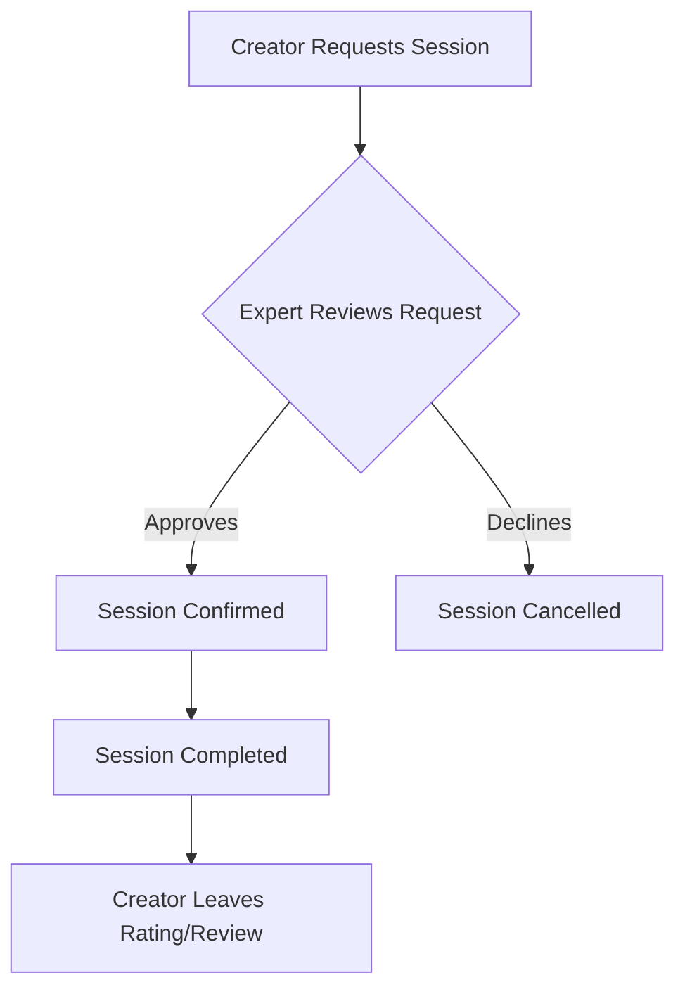
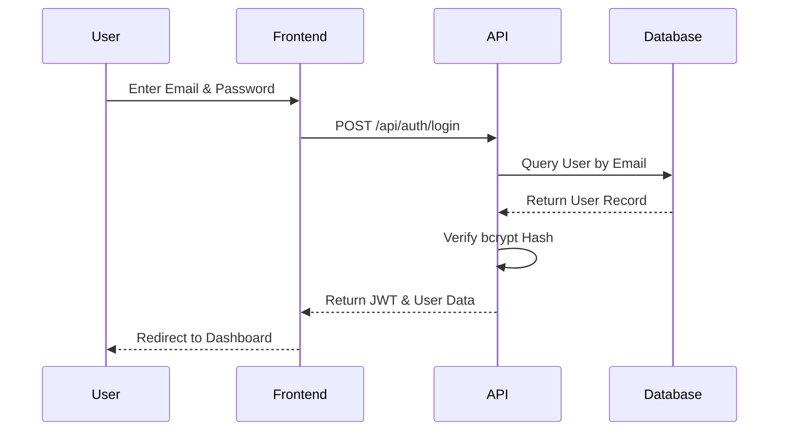
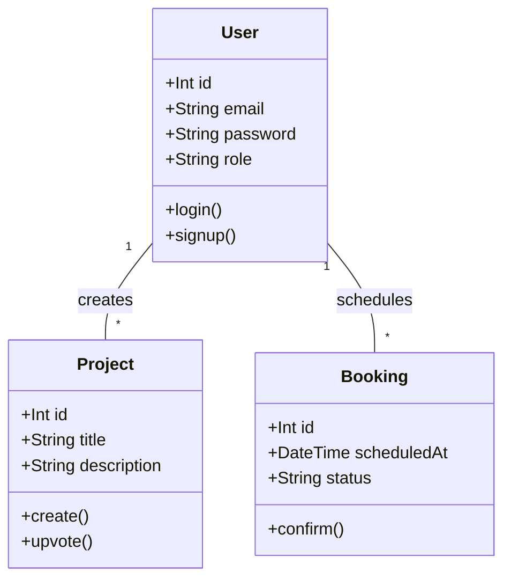

# Project Forge Antigravity: Technical Documentation

## Executive Summary
The **Forge Antigravity** platform is a cross-disciplinary collaboration ecosystem designed to unite developers, UI/UX designers, and technical writers. It accelerates software development by providing an intuitive, high-performance interface for managing projects, sharing curated resources, and facilitating expert mentorship. Unique features include real-time task orchestration, autonomous project matching, and seamless deployment integration via Vercel. It significantly helps users by reducing development friction, automating repetitive collaboration tasks, and providing a centralized hub for multidisciplinary teams to build software effectively.

---

## Chapter 1: Introduction

### 1.1 Problem Statement
Modern software development often suffers from siloed workflows. Developers, UI/UX designers, and technical writers lack a unified platform to seamlessly collaborate, pitch ideas, and find expert mentorship. Existing tools are fragmented across disparate services (e.g., GitHub for code, Dribbble for design, ADPList for mentorship), leading to communication gaps, slow project delivery, and significant friction in team formation.

### 1.2 Aim and Specific Objectives
The primary aim of Forge Antigravity is to provide a cohesive, cross-disciplinary collaboration platform.
**Specific Objectives:**
1. Develop an "Idea Tank" to facilitate project pitching and team building across disciplines.
2. Create a centralized repository for sharing curated design and code resources.
3. Implement a robust booking system for 1:1 expert mentorship sessions.
4. Ensure secure, email-based authentication and authorization.

### 1.3 Justification and Motivation
The motivation stems from the need to democratize access to mentorship and streamline team formation for indie makers, students, and startup founders. Forge bridges the gap between technical and creative professionals, providing a single ecosystem that nurtures a project from ideation to deployment.

### 1.4 Scope and Limitations
**Scope:** Includes user authentication, role-based access (Creator/Expert), project management (CRUD operations), resource sharing, mentorship booking, and notification management.
**Limitations:** The platform currently relies on custom JWT authentication. Comprehensive email verification loops (e.g., magic links) and integrated real-time video conferencing for mentorship sessions are slated for future releases.

### 1.5 Beneficiaries and Academic/Practical Relevance
- **Beneficiaries:** Software engineers, UI/UX designers, technical writers, and industry mentors.
- **Academic/Practical Relevance:** Provides a practical case study in monolithic architecture, serverless deployment, and multidisciplinary agile project management.

### 1.6 Project Activity Planning and Deliverables
- **Planning:** Agile methodology featuring iterative sprints, continuous integration, and deployments on Vercel.
- **Deliverables:** A fully functional web application (SPA), RESTful APIs, a robust PostgreSQL database schema, and this comprehensive technical documentation.

---

## Chapter 2: Review of Related Works

### 2.1 Existing Systems
- **GitHub:** Excellent for version control and code collaboration, but lacks integrated design sharing and mentorship features.
- **Dribbble/Behance:** Industry standards for UI/UX portfolios, but offer no project management or developer-designer collaboration workflows.
- **ADPList:** Premier platform for mentorship, but isolated from the actual workspace where projects are built.

### 2.2 Comparison with Forge Antigravity
Forge Antigravity unifies these isolated concepts. It allows a developer to post an idea (GitHub-style), recruit a designer (Dribbble-style), and book a mentor for architecture review (ADPList-style) entirely within one cohesive ecosystem.

### 2.3 Unique Features and Benefits
- **Unified Workflow:** Eliminates context-switching between different collaboration tools.
- **Role-Based Dynamics:** Distinct capabilities for Creators (ideation) and Experts (mentorship).
- **Resource Hub:** Direct sharing of UI Kits, Code Snippets, and Guides linked to user profiles.

### 2.4 Development Tools and Environment
- **Frontend:** Vanilla JavaScript, HTML5, CSS3.
- **Backend:** Node.js, Express.js.
- **Database:** PostgreSQL (hosted on Supabase) utilizing Prisma ORM (v7.8.0).
- **Deployment:** Vercel (Serverless Functions via `@vercel/node`).

---

## Chapter 3: Methodology

### 3.1 Requirement Specification and Stakeholders
- **Stakeholders:** Creators, Experts, and System Administrators.
- **Gathering Process:** Iterative stakeholder interviews, competitive analysis of existing platforms, and agile user story mapping.

### 3.2 Functional Requirements
1. **Authentication:** Users must be able to securely sign up, log in, and manage their profiles.
2. **Idea Tank:** Users can create, view, comment on, and upvote projects.
3. **Resource Management:** Users can upload and categorize technical/design resources.
4. **Booking System:** Creators can schedule sessions with Experts; Experts can approve/deny requests.

### 3.3 UML Diagrams and Use Case Descriptions

#### 3.3.1 Use Case Diagram
```mermaid
usecaseDiagram
    actor Creator
    actor Expert
    Creator --> (Sign Up / Log In)
    Expert --> (Sign Up / Log In)
    Creator --> (Pitch Idea)
    Creator --> (Book Session)
    Expert --> (Manage Bookings)
    Creator --> (Share Resource)
    Expert --> (Share Resource)
```
**Detailed Use Case Description:**
- **UC1: Sign Up / Log In:** The user submits their email and password. The system validates the input, hashes the password via bcrypt, and generates a JSON Web Token (JWT) to establish a secure session.

#### 3.3.2 Activity Diagram (Booking Flow)


#### 3.3.3 Sequence Diagram (Authentication)


#### 3.3.4 Class Diagram


---

## Chapter 4: Implementation and Results

### 4.1 Logical to Physical Mapping
The application architecture maps a lightweight Express backend to Vercel Serverless Functions. The physical database is a scalable PostgreSQL instance hosted on Supabase, connected via connection pooling (`pg`) and Prisma's driver adapter (`@prisma/adapter-pg`).

### 4.2 Database Schema
```prisma
model User {
  id       Int       @id @default(autoincrement())
  email    String    @unique
  password String
  role     String    @default("CREATOR")
  projects Project[]
}

model Project {
  id          Int      @id @default(autoincrement())
  title       String
  description String
  ownerId     Int
  owner       User     @relation(fields: [ownerId], references: [id])
}
```

### 4.3 Code Snippets
**Robust Database Connection Guard (db.js):**
```javascript
if (!process.env.DATABASE_URL) {
  console.error('[FORGE] FATAL: DATABASE_URL environment variable is not set.');
  throw new Error('Missing required environment variable: DATABASE_URL');
}

const pool = new Pool({
  connectionString: process.env.DATABASE_URL,
  ssl: { rejectUnauthorized: false },
  max: 3,
  idleTimeoutMillis: 30000,
  connectionTimeoutMillis: 10000,
});
```

### 4.4 Deployment Setup on Vercel & Supabase
The deployment utilizes Vercel for the frontend and API, and Supabase for the PostgreSQL database.
- **Vercel Config (`vercel.json`):** Routes all HTTP traffic through `api/index.js` (Express), leveraging `express.static('public')` for frontend asset delivery. The `includeFiles` directive ensures that static assets and Prisma schema files are bundled into the serverless function.
- **Supabase:** Connection pooling (`pgbouncer=true`) is utilized to prevent connection exhaustion from stateless Vercel functions.

### 4.5 Authentication Flow Results
The authentication flow accepts any valid email (e.g., real Gmail accounts). The system hashes the password, securely stores it in Supabase, and provisions a JWT for stateless session management. The application currently runs fully functional online with this secure email-based system.

---

## Chapter 5: Findings and Conclusion

### 5.1 Findings from Implementation
Integrating an Express SPA architecture with Vercel Serverless Functions requires meticulous routing configuration. Initial static asset delivery failed due to conflicting `@vercel/static` builders and wildcard routes. By routing all traffic through Express and utilizing the `includeFiles` configuration, the system achieved stability.

### 5.2 Challenges and Limitations
- **Serverless Database Connections:** Managing Prisma connections in a serverless environment caused intermittent 500 errors. This was resolved by implementing the `pg` pool adapter and enforcing maximum connection limits.
- **Email Verification:** The current scope bypasses SMTP-based email verification in favor of frictionless onboarding.

### 5.3 Lessons Learned
Observability is critical. Adding fast-fail environment variable checks and a dedicated `/api/health` endpoint drastically reduced debugging time in the Vercel production environment.

### 5.4 Recommendations for Future Work
For commercialization, the platform should integrate:
1. OAuth providers (Google, GitHub) for frictionless authentication.
2. WebSockets for real-time chat between Creators and Experts.
3. Stripe integration for monetizing Expert sessions.

### 5.5 References
1. Prisma Documentation (v7.8.0) - Serverless Database Connections.
2. Vercel Documentation - Express.js integrations.
3. Node.js Design Patterns - Singleton connection pooling strategies.
